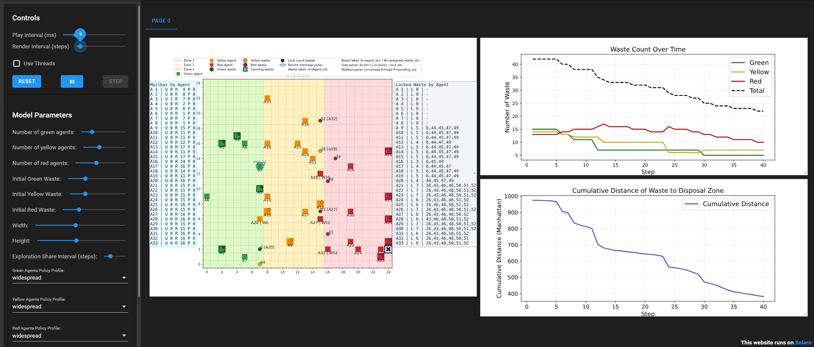
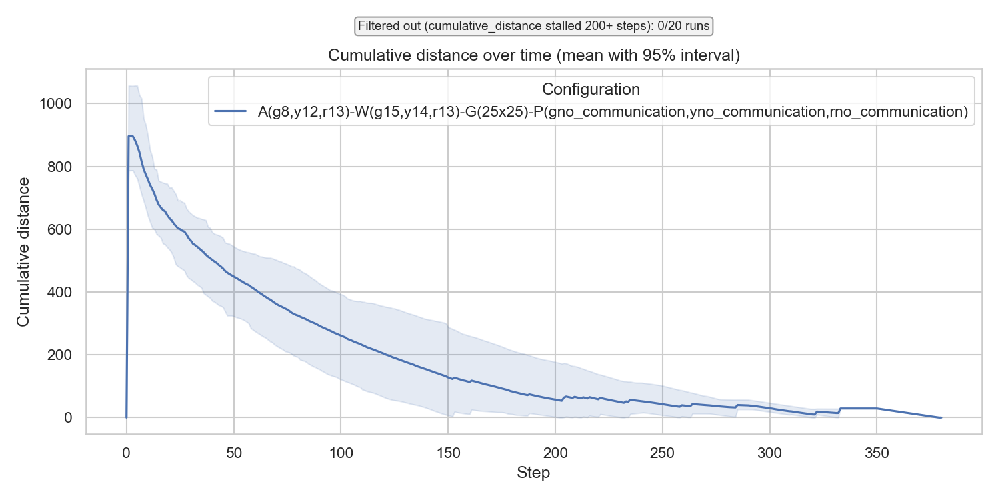
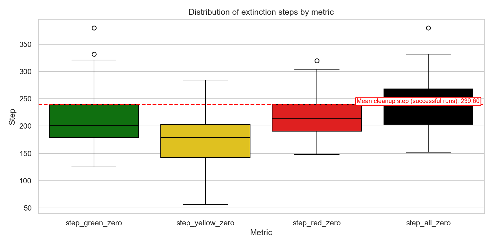
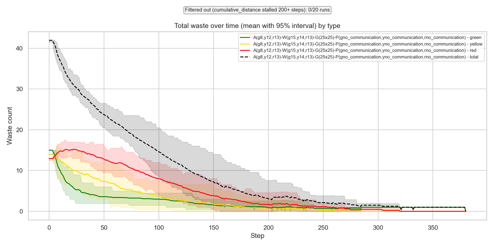
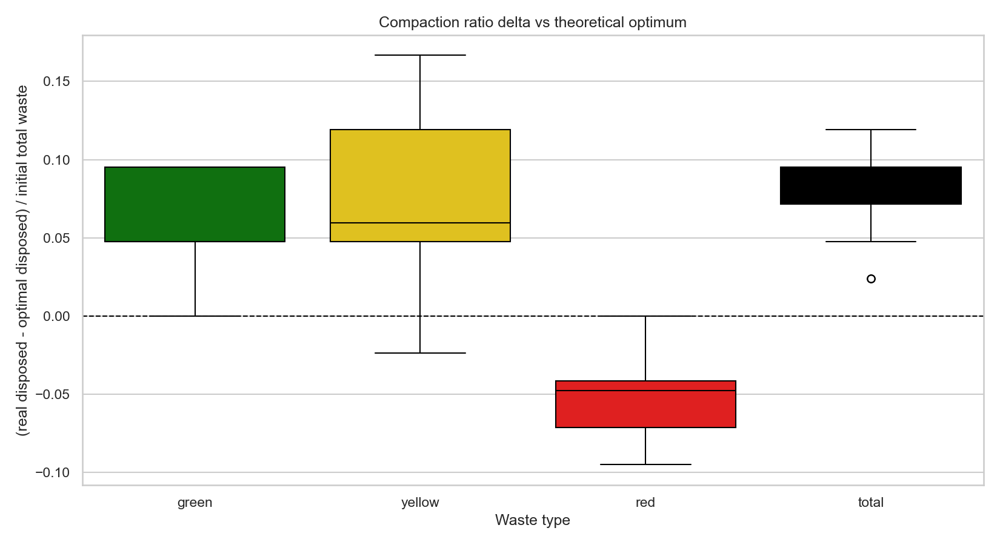
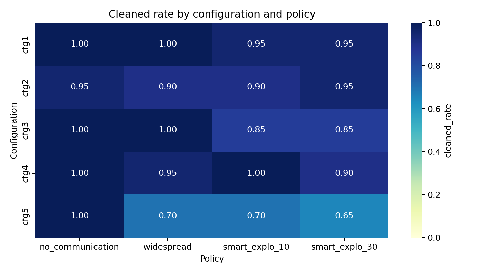
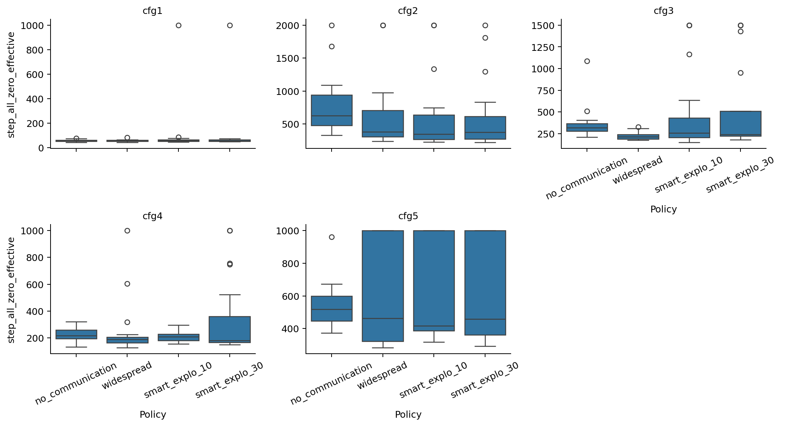

# SMA Report - Multi-Agent Robotic Mission

> Project: SMAck / 12_robot_mission_MAS2026
>
> Team: Corentin Lasne, Tomas Stone, Clara Vega

---

## Table of Contents

1. [Problem Setting](#1-problem-setting)
2. [Tracked Metrics](#2-tracked-metrics)
3. [Implemented Policies](#3-implemented-policies)
4. [Code Architecture, Execution, and Usage](#4-code-architecture-execution-and-usage)
5. [Single Simulation Results](#5-single-simulation-results)
6. [Policy Comparison and Decision](#6-policy-comparison-and-decision)
7. [Limitations and Improvement Paths](#7-limitations-and-improvement-paths)

---

## 1) Problem Setting

### 1.1 General Context

At initialization, a grid of configurable size is created, with 3 areas, along with a configurable number of waste units and agents of different types, randomly placed in their corresponding birth zones (through Solara sliders).

Structural constraints:
- A cell can contain only one robot agent.
- A cell can contain multiple waste units.
- Zone restrictions for each agent type remain active.
- The disposal zone is located randomly in the East of the grid.
- At initialization, each color of waste can be present only in its corresponding zone (green in Z1, yellow in Z2, red in Z3).

### 1.2 Agent Step Dynamics

An agent step is composed of two phases:
- Environment perception.
- Message consultation.

Based on the messages available at step $t$, the agent chooses one action among:
- Send a message.
- Move.
- Pick up an item.
- Drop an item.
- Transform two wastes of the same type into one higher-level waste.

Message consultation is automatic at the beginning of each step, but message sending is a deliberate full action.

### 1.3 Action Legality

An action selected at decision time may become illegal before execution (non-stationary environment).

Rules:
- The model always checks action legality before execution.
- If the action is illegal, the model enforces a legal random fallback action.
- If no legal action is available (e.g., surrounded by 4 agents), the agent performs a no-op (stays in place).

---

## 2) Tracked Metrics

### 2.1 Main Objective

The objective is to clean the area as quickly as possible.

The primary metric is the cumulative distance of wastes to the disposal zone:

$$
D_t = \sum_{w \in map} d_1(w, depot) + \sum_{(a,w) \in inventories} d_1(a, depot)
$$

with:

$$
d_1((x_1,y_1),(x_2,y_2)) = |x_1-x_2| + |y_1-y_2|
$$

Interpretation: the faster $D_t$ converges to $0$, the more efficient the logistics.

### 2.2 Completion Metrics

- `step_green_zero`, `step_yellow_zero`, `step_red_zero`: first extinction step for each type.
- `step_total_zero` / `step_all_zero`: first step where all wastes are eliminated.
- `cleaned`, `timed_out`, `possible_deadlock`: run end-state indicators.

### 2.3 Compaction Metrics (Secondary)

As an additional analysis axis (not the primary optimization target), we track transformation compaction:

$$
compaction\_ratio_k = \frac{disposed_k - optimal_k}{initial\_total\_waste}
$$

For $k \in \{green, yellow, red, total\}$.

Quick interpretation:
- Close to 0: close to theoretical optimum.
- Positive: over-disposal vs optimum.
- Negative: under-disposal vs optimum.

For the exact formulas and CSV column definitions, see [METRICS.md](METRICS.md).

---

## 3) Implemented Policies

Available profiles (for each agent color):
- `no_communication`
- `widespread`
- `widespread_com_smart_explo`

For the full policy breakdown aligned with the code, see:
- [policy_no_communication.md](policy_no_communication.md)
- [policy_widespread.md](policy_widespread.md)
- [policy_widespread_com_smart_explo.md](policy_widespread_com_smart_explo.md)

### 3.2 General Behavioral Logic

Common priority structure (typical order):
- Delivery priorities / carry timeout handling.
- Transformation actions when conditions are met.
- Pickup / movement toward known targets.
- Exploration.
- Coordination communication (depending on profile).

### 3.3 Expected Qualitative Behavior

| Profile | Communication | Exploration | Transport Coordination |
|---|---|---|---|
| `no_communication` | None | Standard | Limited |
| `widespread` | High | Standard | Good |
| `widespread_com_smart_explo` | High | Smart sharing | Good |

---

## 4) Code Architecture, Execution, and Usage

### 4.1 Software Organization

- `model.py`: core model dynamics, global step, legality checks, metrics, zones, and depot.
- `agents.py`: agent definitions (green/yellow/red), internal state, perception/action.
- `messaging.py`: message structures and mailboxes.
- `objects.py`: environment objects (waste, radioactivity, etc.).
- `policies/`: deliberation strategies by color and profile.
- `server.py`: interactive Solara visualization.
- `run.py`: batch runner, CSV outputs, plots, and multi-run analysis.
- `config.py`: default parameters and action constants.

### 4.2 Interactive Execution (Solara)

```bash
solara run server.py
```

Usage: adjust sliders (grid size, number of agents/wastes, policies), then observe the simulation in real time.

Example:


*Figure 1 - Front-end of the Solara simulation.*

On the left, sliders for configuration. Choice of :
- Number of agents by color.
- Number of wastes by color.
- Grid size.
- Policy profiles for each color.
- Extra paramaters in case of smart exploration : interval steps (which correpsonds to the step frequency of sharing explored positions between agents).

On the middle, the grid visualization with agents (colored circles) and wastes (colored squares). The table on the right keeps a track on the mailbox of each agent (unread, sent, read). The table on the left keeps a track on the lock history. Legends of the agent and waste on the simulation keep track of the assignments.

On the left two graphs :
- Waste count over time (by type and total).
- Cumulative distance to disposal zone over time.

The simulation stops when all waste is cleaned (can be infinite if deadlocked).

### 4.3 Batch Execution (Statistics)

Example (single configuration, multiple iterations):

```bash
python run.py --green-agents 8 --yellow-agents 12 --red-agents 13 --green-waste 15 --yellow-waste 14 --red-waste 13 --width 25 --height 25 --iterations 20 --max-steps 1000 --number-processes 1
```

Generated outputs in `batch_outputs/batch_YYYYMMDD_HHMMSS/`:
- `batch_run_raw.csv`
- `timeseries.csv`
- `summary.csv`
- `suspicious_runs.csv`
- `filtered_runs_distance_stall.csv` (if applicable)
- figure files (`*.png`): extinction, distance, compaction, and waste-over-time plots.

---

## 5) Example batch run results

> Objective: present one representative case in detail (configuration, curves, interpretation).

### 5.1 Tested Configuration

- Agents: 8 green, 12 yellow, 13 red.
- Wastes: 15 green, 14 yellow, 13 red.
- Grid: 25x25.
- Policies: no_communication for all colors.
- Max steps: 1000.
- Iterations: 20.

### 5.2 Main Figures

Insert below the figures exported by the batch process:


*Figure 2 - Cumulative distance to disposal zone over time (mean and 95% interval).*


*Figure 3 - Distribution of extinction steps by metric.*


*Figure 4 - Waste count evolution by type and total.*


*Figure 5 - Compaction gap relative to the theoretical optimum.*

The optimal compaction ratios are calculated as follows:

$$
\begin{aligned}
optimal_{green} &= n_{green\_waste} \bmod 2, \\
g\_to\_y &= \left\lfloor \frac{n_{green\_waste}}{2} \right\rfloor, \\
yellow\_pool &= g\_to\_y + n_{yellow\_waste}, \\
optimal_{yellow} &= yellow\_pool \bmod 2, \\
optimal_{red} &= \left\lfloor \frac{yellow\_pool}{2} \right\rfloor + n_{red\_waste}, \\
optimal_{total} &= optimal_{green} + optimal_{yellow} + optimal_{red}
\end{aligned}
$$

Then, for each type $k \in \{green, yellow, red, total\}$:

$$
compaction\_ratio_k = \frac{disposed_k - optimal_k}{initial\_total\_waste}
$$

For red, this does not mean that red waste is compacted again. It means that the metric measures the gap between the observed red disposal and the theoretical optimum obtained after compacting green waste into yellow, then yellow waste into red. Red is the final level of the chain, so it only accumulates what has been transformed upward plus the red waste present from the start.

### 5.3 Result Interpretation

- Decay speed of `cumulative_distance` : seems to follow a power law.
- Gap between green, yellow, red, and total extinction steps : seems to be pretty similar cause no bottleneck at initialization.
- Compaction behavior : as expected, not all green and yellow wastes are compacted and so we miss some red wastes that should have been compacted.

---

## 6) Policy Comparison and Decision

> Objective: decide on the value of each policy using a clear evaluation framework.

### Tested Configurations Summary

All comparisons in this section use 20 iterations per run with controlled seeds, and the same initialization settings across policy variants.

| Config ID | Agents (g,y,r) | Wastes (g,y,r) | Grid (W x H) | Notes |
|---|---|---|---|---|
| C1 | 3, 3, 3 | 4, 4, 4 | 8 x 8 | Low agents, low wastes, small grid |
| C2 | 6, 6, 6 | 9, 9, 9 | 40 x 40 | Low agents, low wastes, large grid |
| C3 | 6, 6, 6 | 15, 15, 15 | 22 x 22 | Low agents, high wastes, medium grid (corrected waste count) |
| C4 | 14, 14, 14 | 18, 18, 18 | 22 x 22 | Medium agents, medium wastes, medium grid |
| C5 | 22, 22, 22 | 35, 35, 35 | 40 x 40 | High agents, high wastes, large grid |

Compared policy variants for each configuration:
- `no_communication`
- `widespread`
- `widespread_com_smart_explo` with `exploration_share_interval_steps = 10`
- `widespread_com_smart_explo` with `exploration_share_interval_steps = 30`

### 6.1 Comparison Protocol

- Same step budget and same grid size.
- Same initial distribution of agents/wastes (or controlled seeds).

| config | policy | cleaned_rate | median_step_all_zero_effective | median_compaction_ratio_total | max_steps | n_runs |
|---|---|---:|---:|---:|---:|---:|
| cfg1 | no_communication | 100.0% | 57.00 | 0.17 | 1000 | 20 |
| cfg2 | no_communication | 95.0% | 627.00 | 0.09 | 2000 | 20 |
| cfg3 | no_communication | 100.0% | 315.50 | 0.07 | 1500 | 20 |
| cfg4 | no_communication | 100.0% | 216.00 | 0.11 | 1000 | 20 |
| cfg5 | no_communication | 100.0% | 517.50 | 0.08 | 1000 | 20 |
| cfg1 | widespread | 100.0% | 57.50 | 0.21 | 1000 | 20 |
| cfg2 | widespread | 90.0% | 380.00 | 0.13 | 2000 | 20 |
| cfg3 | widespread | 100.0% | 214.00 | 0.09 | 1500 | 20 |
| cfg4 | widespread | 95.0% | 188.50 | 0.13 | 1000 | 20 |
| cfg5 | widespread | 70.0% | 463.50 | 0.09 | 1000 | 20 |
| cfg1 | smart_explo_10 | 95.0% | 60.50 | 0.25 | 1000 | 20 |
| cfg2 | smart_explo_10 | 90.0% | 344.50 | 0.13 | 2000 | 20 |
| cfg3 | smart_explo_10 | 85.0% | 257.00 | 0.08 | 1500 | 20 |
| cfg4 | smart_explo_10 | 100.0% | 209.00 | 0.15 | 1000 | 20 |
| cfg5 | smart_explo_10 | 70.0% | 418.00 | 0.11 | 1000 | 20 |
| cfg1 | smart_explo_30 | 95.0% | 57.00 | 0.25 | 1000 | 20 |
| cfg2 | smart_explo_30 | 95.0% | 373.00 | 0.15 | 2000 | 20 |
| cfg3 | smart_explo_30 | 85.0% | 238.00 | 0.09 | 1500 | 20 |
| cfg4 | smart_explo_30 | 90.0% | 179.50 | 0.13 | 1000 | 20 |
| cfg5 | smart_explo_30 | 65.0% | 459.00 | 0.09 | 1000 | 20 |


Cleaned rate is a metric that measures the percentage of runs that successfully cleaned all waste within the step limit.
- For the policies without communication, a cleaned rate < 100% means that the maximum step limit was reached without cleaning all waste in some runs, which can be due to inefficient exploration or local congestion.
- For the policies with communication, a cleaned rate < 100% is explained by several deadlocks that couldn't have been solved for every situation. 
In global, the 'widespread' policy is more reliable than the 'widespread_com_smart_explo' policies, which are more sensitive to the configuration and the exploration sharing interval. The 'no_communication' policy is the most robust one, with a cleaned rate of almost 100% in all configurations. Because a lack of time, it was not possible to investigate more deeply the causes of the deadlocks, but they are likely to be related to the fact that the smart exploration sharing is not perfectly efficient and can lead to some agents being stuck in a local area without being able to find a way out.

Figure A - cleaned rate heatmap:



Figure B - boxplot of `step_all_zero_effective` by policy and configuration:



Full plots available in appendix/folder outputs.

### 6.3 Per-Configuration Synthesis

`cfg1`: With few agents, few wastes, and a small grid, the system is already close to a self-organized regime where the baseline performs almost as well as anything else. Communication brings little to no visible gain here because the generation is dense enough that agents tend to meet waste quickly anyway. The main conclusion is that this setting is not very discriminative for policy comparison.

`cfg2`: When agents remain few but waste is sparse on a large grid, communication becomes genuinely useful because local search by chance is no longer sufficient. In that regime, the communication policies outperform the baseline in speed, but the robustness is still uneven and depends on how reliably the coordination succeeds. Smart exploration with interval 10 is the fastest variant, while interval 30 tends to be more conservative.

`cfg3`: With few agents, more waste, and a medium grid, communication gives a clearer advantage than in `cfg1`, because random encounters are no longer enough to guarantee efficient cleanup. The `widespread` policy is the best compromise here: it keeps full robustness while improving completion time compared with `no_communication`. Smart exploration remains useful, with interval 30 slightly better when the objective is to reduce idle wandering.

`cfg4`: Once the number of agents and wastes becomes medium-sized, the communication policies still help, but the system also becomes more fragile because coordination errors and local congestion appear more often. This is where the speed gains from communication are visible, but the robustness gap starts to matter more. In this configuration, interval 10 is the safer smart-exploration choice, while interval 30 is the faster but less stable one.

`cfg5`: In the largest and most crowded setting, communication is potentially very valuable because the search space is large and each agent step matters more. However, this is also where the current communication logic shows its main weakness: robustness drops and the statistics suffer from unresolved coordination failures. Smart exploration is still attractive here, but only if the communication robustness is improved first.

### 6.4 Final Decision

Selected decision: `no_communication` is already a good default robust baseline. And eventhought, the policies with communication are not fully robust (and need to be improoved in that sense), when it's working `widespread` is way more efficient than the baseline in general and `widespread_com_smart_explo` is even a bit better when it works. Stats are just biased by the non robust runs, which are more frequent in the communication policies. So we can keep the communication policies as interesting variants to be improved.

Three-point justification:
1. `no_communication` is the only policy that remains consistently robust across all tested configurations, including the hardest one (`cfg5`).
2. `widespread` can significantly reduce median cleanup steps in some settings, but its robustness degrades in high-load/high-grid scenarios.
3. `widespread_com_smart_explo` is very configuration-sensitive. It can be the fastest in some cases, but it also has the lowest robustness, especially with a short sharing interval.

---

## 7) Limitations and Improvement Paths

Current limitations:
- Possible atypical runs (distance stagnation, timeout, heuristic deadlock).
- Sensitivity to hyperparameters (grid size, density, agent/waste ratio).

